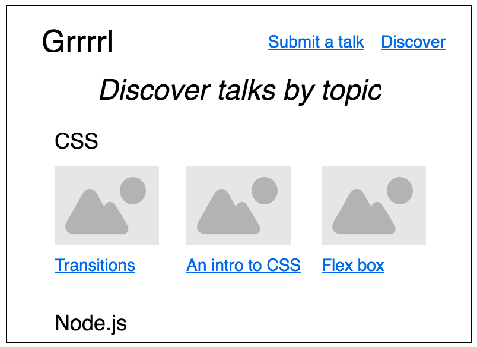
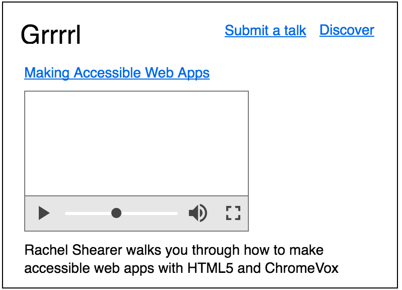

# grrrrl

grrrrl is a project to compile tech talks by underrepresented communities in the technology industry.

The project is currently empty and needs a Homepage (`index.html`) where you can search and a Discover page where you can find cool videos (perhaps by topic?)

We want to curate a list of great videos, tag them and showcase them for all to find easily!

## Wireframes

These are suggested wireframes. If you want to edit them contact @tas12 so she can add you as a collaborator on moqups (or you can start from scratch).

### Home

### Discover

### Results

### View

### Submit a talk

